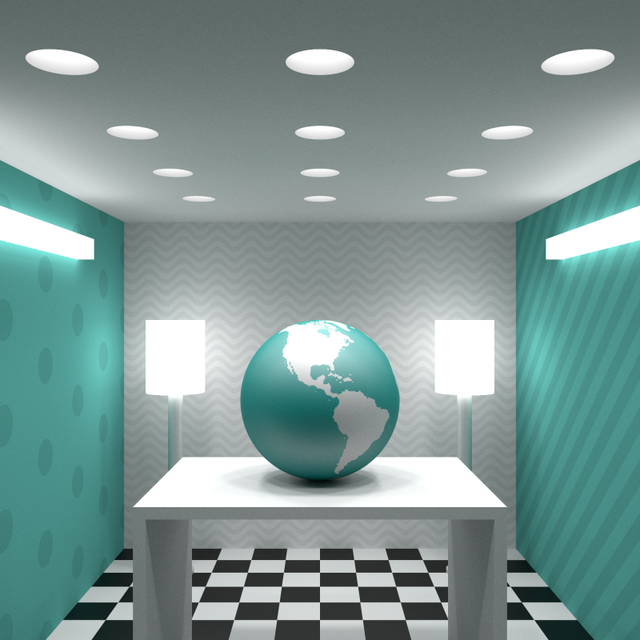

# tiffany

This rendering example creates textured objects with Tiffany Blue coloration. It shows how one might render:

 * Inset ceiling lights
 * Area lights
 * Textures - both hard-coded and image-based

By default, this demo outputs a grainy low-resolution rendering (which takes a minute or two):


Raising the quality and resolution is as simple as modifying these lines:

```go
NumSamples:           200,
MinSamples:           200,
MaxStddev:            0.05,
```

and this line:

```go
img := render3d.NewImage(200, 200)
```

Simply increase NumSamples to maybe `100000`, increase MinSamples to `10000`, decrease `MaxStddev` to something like `0.02` (lower values mean less noise), and increase the resolution from 200x200 to whatever you want. Here's an example HD rendering at 800x800:


